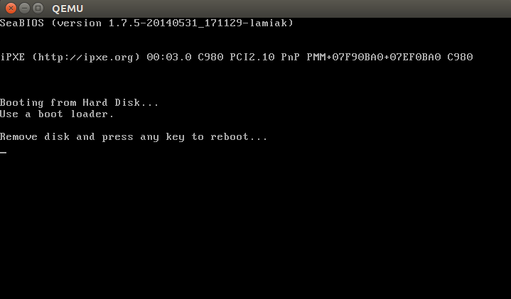

Kernel booting process. Part 1.
================================================================================

ブートローダーからカーネルまで
--------------------------------------------------------------------------------

<<<<<<< HEAD

もし私のブログの[記事](http://0xax.blogspot.com/search/label/asm)を読まれた方はご存じかと思いますが、ちょっと前から低レイヤーのプログラミングを行っています。
Linux用x86_64アセンブリによるプログラミングについて記事を書いていて、Linuxのソースコードにも触れるようになりました。
低レイヤーがどのように機能しているのか、コンピュータでプログラムがどのように実行されるのか、どのようにメモリに配置されるのか、カーネルがどのようにプロセスとメモリを扱うのか、低レイヤーでネットワークスタックがどのように動くのか等、多くのことを理解しようととても興味が湧いています。
それで、**x86_64** のLinux カーネルについてのシリーズを書こうと決心しました。

私はプロのカーネルプログラマではないことと、仕事でもカーネルのコードを書いていないことをご了承ください。
ただの趣味です。私は低レイヤーが単に好きで、どのようにして動いているのかとても興味があります。もし何か困惑した点や、ご質問やご意見がありましたら、Twitter [0xAX](https://twitter.com/0xAX) や [email](anotherworldofworld@gmail.com) でお知らせいただくか、[issue](https://github.com/0xAX/linux-insides/issues/new)を作成してください。
そうしてくれると助かります。全ての記事は [linux-insides](https://github.com/0xAX/linux-insides) からアクセスでき、私の英文が間違っていたり内容に問題があったりした場合は、気軽にプルリクエストを送ってください。
=======
If you read my previous [blog posts](https://0xax.github.io/categories/assembler/), you might have noticed that I  have been involved with low-level programming for some time. I wrote some posts about assembly programming for `x86_64` Linux and, at the same time, started to dive into the Linux kernel source code.

I have a great interest in understanding how low-level things work, how programs run on my computer, how they are located in memory, how the kernel manages processes and memory, how the network stack works at a low level, and many many other things. So, I decided to write yet another series of posts about the Linux kernel for the **x86_64** architecture.

Note that I'm not a professional kernel hacker and I don't write code for the kernel at work. It's just a hobby. I just like low-level stuff, and it is interesting for me to see how these things work. So if you notice anything confusing, or if you have any questions/remarks, ping me on Twitter [0xAX](https://twitter.com/0xAX), drop me an [email](anotherworldofworld@gmail.com) or just create an [issue](https://github.com/0xAX/linux-insides/issues/new). I appreciate it.

All posts will also be accessible at [github repo](https://github.com/0xAX/linux-insides) and, if you find something wrong with my English or the post content, feel free to send a pull request.
>>>>>>> upstream/master

*これは正式なドキュメントではありません。あくまでも学習のためや知識共有のためのものですのでご注意ください。*

**必要な知識**

* Cコードの理解
* アセンブリ(AT&T記法)の理解

<<<<<<< HEAD
ツールについて学び始めている人のために、この記事とつづく記事の中で説明を入れようと思います。さて、簡単な導入はここで終わりにして、今からカーネルと低レイヤーにダイブしましょう。

全てのコードはカーネル 3.18のものです。変更があった場合は、私はそれに応じて更新します。
=======
Anyway, if you're just starting to learn such tools, I will try to explain some parts during this and the following posts. Alright, this is the end of the simple introduction. Let's start to dive into the Linux kernel and low-level stuff!

I started writing these posts at the time of the `3.18` Linux kernel, and many things have changed since that time. If there are changes, I will update the posts accordingly.
>>>>>>> upstream/master

魔法の電源ボタンの次はなにが起こるのか？
--------------------------------------------------------------------------------

<<<<<<< HEAD
本連載はLinux カーネルついてのシリーズですが、カーネルのコードからは始めません。 - 少なくともこの段落では。ラップトップやデスクトップコンピューターは魔法の電源ボタンを押すと起動します。
マザーボードは電源回路([power supply](https://en.wikipedia.org/wiki/Power_supply))に信号を送ります。
信号を受信した後、電源はコンピュータに適切な量の電力を供給します。
マザーボードは、[power good signal](https://en.wikipedia.org/wiki/Power_good_signal)を受信すると、CPUを起動しようとします。
CPUはレジスタに残されたデータをリセットし、事前に定義された値をレジスタに設定します。


[80386](https://en.wikipedia.org/wiki/Intel_80386) や後継のCPUでは、コンピュータがリセットされると次の事前に定義された値がCPUレジスタに書き込まれます。:
=======
Although this is a series of posts about the Linux kernel, we won't start directly from the kernel code. As soon as you press the magical power button on your laptop or desktop computer, it starts working. The motherboard sends a signal to the [power supply](https://en.wikipedia.org/wiki/Power_supply) device. After receiving the signal, the power supply provides the proper amount of electricity to the computer. Once the motherboard receives the [power good signal](https://en.wikipedia.org/wiki/Power_good_signal), it tries to start the CPU. The CPU resets all leftover data in its registers and sets predefined values for each of them.

The [80386](https://en.wikipedia.org/wiki/Intel_80386) and later CPUs define the following predefined data in CPU registers after the computer resets:
>>>>>>> upstream/master

```
IP          0xfff0
CS selector 0xf000
CS base     0xffff0000
```

<<<<<<< HEAD
プロセッサは[リアルモード](https://en.wikipedia.org/wiki/Real_mode)で動き始めます。少し戻って、このモードの memory segmentation を理解しましょう。リアルモードは、[8086](https://en.wikipedia.org/wiki/Intel_8086)から、最新のIntel 64-bit CPUまでのすべてのx86互換のプロセッサに導入されています。
8086プロセッサには20-bit アドレスバスがあります。つまり、0-0xFFFFF(1MB)のアドレス空間を利用できます。
しかし、16ビットのレジスタしかなく、16ビットのレジスタが使用できるアドレスは最大で `2^16-1`、 または `0xffff`(64KB)までです。[Memory segmentation](http://en.wikipedia.org/wiki/Memory_segmentation)は、利用可能なアドレス空間すべてを利用するために用いられる方法です。
全てのメモリは65535 Byteまたは64KBの固定長の小さなセグメントに分けられます。16-bit レジスタでは、64KB以上のメモリ位置にアクセスできないので、別の方法でアクセスします。
アドレスは2つのパートで構成されます: ベースアドレスを持つセグメントセレクタとそのバースアドレスからのオフセットである。
リアルモードでは、セグメントセレクタのベースアドレスは`Segment Selector * 16`となります。
そのため、物理アドレスを得るには、セグメントアドレスに16をかけたものに、オフセットアドレスを足す必要があります。:
=======
The processor starts working in [real mode](https://en.wikipedia.org/wiki/Real_mode). Let's back up a little and try to understand [memory segmentation](https://en.wikipedia.org/wiki/Memory_segmentation) in this mode. Real mode is supported on all x86-compatible processors, from the [8086](https://en.wikipedia.org/wiki/Intel_8086) CPU all the way to the modern Intel 64-bit CPUs. The `8086` processor has a 20-bit address bus, which means that it could work with a `0-0xFFFFF` or `1 megabyte` address space. But it only has `16-bit` registers, which have a maximum address of `2^16 - 1` or `0xffff` (64 kilobytes).

[Memory segmentation](https://en.wikipedia.org/wiki/Memory_segmentation) is used to make use of all the address space available. All memory is divided into small, fixed-size segments of `65536` bytes (64 KB). Since we cannot address memory above `64 KB` with 16-bit registers, an alternate method was devised.

An address consists of two parts: a segment selector, which has a base address; and an offset from this base address. In real mode, the associated base address of a segment selector is `Segment Selector * 16`. Thus, to get a physical address in memory, we need to multiply the segment selector part by `16` and add the offset to it:
>>>>>>> upstream/master

```
PhysicalAddress = Segment Selector * 16 + Offset
```

例えば、`CS:IP`が`0x2000:0x0010`の場合、物理アドレスは次のようになります。:

```python
>>> hex((0x2000 << 4) + 0x0010)
'0x20010'
```

しかし、セグメント部分とオフセット部分を両方最大にした場合、つまり`0xffff:0xffff`の場合は次のようになります。

```python
>>> hex((0xffff << 4) + 0xffff)
'0x10ffef'
```

<<<<<<< HEAD
つまり、最初の1MBよりも65519Byteオーバーしていることになります。リアルモードでアクセスできるのは最大で1MBのため、[A20ライン](https://en.wikipedia.org/wiki/A20_line)が無効になっていると`0x10ffef`は`0x00ffef`になります。

リアルモードとmemory addressingが分かったところで、リセット後のレジスタの値について説明しましょう。

`CS`レジスタは、見えるセグメントセレクタと隠れたベースアドレスの2つの部分で構成されています。 ベースアドレスは、セグメントセレクタの値に16を乗算することによって形成されるが、ハードウェアがリセットされる間、CSレジスタ内のセグメントセレクタには`0xf000`が代入され、ベースアドレスに`0xffff0000`が代入されます。 プロセッサは、`CS`が変更されるまで、この特殊なベースアドレスを使用します。
=======
which is `65520` bytes past the first megabyte. Since only one megabyte is accessible in real mode, `0x10ffef` becomes `0x00ffef` with the [A20 line](https://en.wikipedia.org/wiki/A20_line) disabled.

Ok, now we know a little bit about real mode and its memory addressing. Let's get back to discussing register values after reset.

The `CS` register consists of two parts: the visible segment selector and the hidden base address. While the base address is normally formed by multiplying the segment selector value by 16, during a hardware reset the segment selector in the CS register is loaded with `0xf000` and the base address is loaded with `0xffff0000`. The processor uses this special base address until `CS` changes.
>>>>>>> upstream/master


開始するアドレスはベースアドレスをEIPレジスタの値に足すことで生成されます。:

```python
>>> 0xffff0000 + 0xfff0
'0xfffffff0'
```

<<<<<<< HEAD
その結果、`0xfffffff0`ができ、この値は4GBより16byte小さいです。
このポイントを[Reset vector](http://en.wikipedia.org/wiki/Reset_vector)と呼びます。
このメモリ配置には、リセット後にCPUが最初に実行するプログラムが置かれています。
これには、[`JMP`](http://en.wikipedia.org/wiki/JMP_%28x86_instruction%29) 命令が含まれ、BIOSのエントリポイントを指しています。
例えば、[coreboot](http://www.coreboot.org/)のソースコードを見ると、次のように書かれています。:
=======
We get `0xfffffff0`, which is 16 bytes below 4GB. This point is called the [reset vector](https://en.wikipedia.org/wiki/Reset_vector). It's the memory location at which the CPU expects to find the first instruction to execute after reset. It contains a [jump](https://en.wikipedia.org/wiki/JMP_%28x86_instruction%29) (`jmp`) instruction that usually points to the [BIOS](https://en.wikipedia.org/wiki/BIOS) (Basic Input/Output System) entry point. For example, if we look in the [coreboot](https://www.coreboot.org/) source code (`src/cpu/x86/16bit/reset16.inc`), we see:
>>>>>>> upstream/master

```assembly
    .section ".reset", "ax", %progbits
    .code16
.globl	_start
_start:
    .byte  0xe9
    .int   _start16bit - ( . + 2 )
    ...
```

<<<<<<< HEAD
JMP命令の[オペコード](http://ref.x86asm.net/coder32.html#xE9)である`0xe9`と、そのデスティネーションアドレスである`_start - ( . + 2)`があります。また、`reset`セクションが16 Byteで`0xfffffff0`から始まることが分かります。:
=======
Here we can see the `jmp` instruction [opcode](http://ref.x86asm.net/coder32.html#xE9), which is `0xe9`, and its destination address at `_start16bit - ( . + 2)`.

We also see that the `reset` section is `16` bytes and is compiled to start from the address `0xfffffff0` (`src/cpu/x86/16bit/reset16.ld`):
>>>>>>> upstream/master

```
SECTIONS {
    /* Trigger an error if I have an unuseable start address */
    _bogus = ASSERT(_start16bit >= 0xffff0000, "_start16bit too low. Please report.");
    _ROMTOP = 0xfffffff0;
    . = _ROMTOP;
    .reset . : {
        *(.reset);
        . = 15;
        BYTE(0x00);
    }
}
```

<<<<<<< HEAD
ここでBIOSが実行されます。ハードウェアの初期化とチェックを行い、BIOSはブートできるデバイスを探す必要があります。
ブート順位はBIOSの設定に保存されており、カーネルがどのデバイスを使用して起動するのかを操作します。
ハードドライブから起動しようとする場合、BIOSはブートセクタを探そうとします。
ハードディスクにMBRのパーティションがある場合、ブートセクタは最初のセクター（512 Byte）の最初の446 Byteに置かれています。最初のセクターの最後2バイトは`0x55`と`0xaa`で、BIOSにこのデバイスがブート可能であることを知らせます。例:
=======
Now the BIOS starts. After initializing and checking the hardware, the BIOS needs to find a bootable device. A boot order is stored in the BIOS configuration, controlling which devices the BIOS attempts to boot from. When attempting to boot from a hard drive, the BIOS tries to find a boot sector. On hard drives partitioned with an [MBR partition layout](https://en.wikipedia.org/wiki/Master_boot_record), the boot sector is stored in the first `446` bytes of the first sector, where each sector is `512` bytes. The final two bytes of the first sector are `0x55` and `0xaa`, which designates to the BIOS that this device is bootable.

For example:
>>>>>>> upstream/master

```assembly
;
; Note: this example is written in Intel Assembly syntax
;
[BITS 16]

boot:
    mov al, '!'
    mov ah, 0x0e
    mov bh, 0x00
    mov bl, 0x07

    int 0x10
    jmp $

times 510-($-$$) db 0

db 0x55
db 0xaa
```

ビルドして実行します:

```
nasm -f bin boot.nasm && qemu-system-x86_64 boot
```

<<<<<<< HEAD
上のコードが[QEMU](http://qemu.org)にディスクイメージとしてビルドした`boot`バイナリを使用するよう命令します。
上のアセンブリコードによって生成されるバイナリはブートセクタの要件（開始位置は`0x7c00`に設定され、マジックシーケンスで終点を指定）を満たしているので、QEMUはそのバイナリをディスクイメージのMBR(master boot record)として扱います。
=======
This will instruct [QEMU](https://www.qemu.org/) to use the `boot` binary that we just built as a disk image. Since the binary generated by the assembly code above fulfills the requirements of the boot sector (the origin is set to `0x7c00` and we end it with the magic sequence), QEMU will treat the binary as the master boot record (MBR) of a disk image.
>>>>>>> upstream/master

このようになります:


<<<<<<< HEAD
この例では、16-bit リアルモードでコードが実行され、メモリの`0x7c00`から始まります。
実行されると、[0x10](http://www.ctyme.com/intr/rb-0106.htm) 割り込みが呼び出され、`!`シンボルが出力されます。残りの510 Byteを0で埋め、2つのマジックバイト`0xaa`と`0x55`で終わります。
=======
In this example, we can see that the code will be executed in `16-bit` real mode and will start at `0x7c00` in memory. After starting, it calls the [0x10](http://www.ctyme.com/intr/rb-0106.htm) interrupt, which just prints the `!` symbol. It fills the remaining `510` bytes with zeros and finishes with the two magic bytes `0xaa` and `0x55`.
>>>>>>> upstream/master

`objdump`でダンプした結果は以下のコマンドで見れます:

```
nasm -f bin boot.nasm
objdump -D -b binary -mi386 -Maddr16,data16,intel boot
```

<<<<<<< HEAD
実際のブートセクタの場合、この続きは多くの0たちや感嘆符ではなく、起動処理とパーティションテーブルになります。これ以降はBIOSからブートローダーに動作が移ります。

**注**: 上でも書いたようにCPUはリアルモードで動作します。リアルモードでは、メモリ内の物理アドレスを次のように計算します。:
=======
A real-world boot sector has code for continuing the boot process and a partition table instead of a bunch of 0's and an exclamation mark. :) From this point onwards, the BIOS hands control over to the bootloader.

**NOTE**: As explained above, the CPU is in real mode. In real mode, calculating the physical address in memory is done as follows:
>>>>>>> upstream/master

```
PhysicalAddress = Segment Selector * 16 + Offset
```

<<<<<<< HEAD
前述したように、16bit の汎用レジスタしかなく、16-bit レジスタの最大値は`0xffff`のため、最大値を取ると次のようになります。:
=======
just as explained above. We have only 16-bit general purpose registers, which has a maximum value of `0xffff`, so if we take the largest values the result will be:
>>>>>>> upstream/master

```python
>>> hex((0xffff * 16) + 0xffff)
'0x10ffef'
```

0x10ffefは、`1MB + 64KB - 16B`と同じになります。
しかし、[8086](https://en.wikipedia.org/wiki/Intel_8086)プロセッサは、リアルモードが搭載された初めてのプロセッサであり、A20アドレスラインを持っています。
また、2^20 = 1048576は1MBなので、実際に使用可能なメモリは1MBとなっています。

<<<<<<< HEAD
一般的なリアルモードでのメモリマップは次のとおりです。:
=======
In general, real mode's memory map is as follows:
>>>>>>> upstream/master

```
0x00000000 - 0x000003FF - Real Mode Interrupt Vector Table
0x00000400 - 0x000004FF - BIOS Data Area
0x00000500 - 0x00007BFF - Unused
0x00007C00 - 0x00007DFF - Our Bootloader
0x00007E00 - 0x0009FFFF - Unused
0x000A0000 - 0x000BFFFF - Video RAM (VRAM) Memory
0x000B0000 - 0x000B7777 - Monochrome Video Memory
0x000B8000 - 0x000BFFFF - Color Video Memory
0x000C0000 - 0x000C7FFF - Video ROM BIOS
0x000C8000 - 0x000EFFFF - BIOS Shadow Area
0x000F0000 - 0x000FFFFF - System BIOS
```

<<<<<<< HEAD
本稿の最初の部分でも書きましたが、CPUが実行する最初の処理は `0xFFFFFFF0` アドレスに配置されています。
これは、`0xFFFFF` (1MB)よりはるかに大きい領域です。CPUはどのようにしてこのリアルモードでアクセスするのでしょうか。
これは[coreboot](http://www.coreboot.org/Developer_Manual/Memory_map)のドキュメントに記載されています。:
=======
At the beginning of this post, I wrote that the first instruction executed by the CPU is located at address `0xFFFFFFF0`, which is much larger than `0xFFFFF` (1MB). How can the CPU access this address in real mode? The answer is in the [coreboot](https://www.coreboot.org/Developer_Manual/Memory_map) documentation:
>>>>>>> upstream/master

```
0xFFFE_0000 - 0xFFFF_FFFF: 128 kilobyte ROM mapped into address space
```

実行時、BIOSはRAMではなくROMに置かれています。

ブートローダー
--------------------------------------------------------------------------------

<<<<<<< HEAD
[GRUB2](https://www.gnu.org/software/grub/) や [syslinux](http://www.syslinux.org/wiki/index.php/The_Syslinux_Project) のような、Linuxを起動させることができるブートローダーは数多くあります。
Linuxカーネルは、Linuxサポートを実行するためのブートローダーに必要な条件を指定する[Boot protocol](https://github.com/torvalds/linux/blob/master/Documentation/x86/boot.txt)を持っています。
ここでは例として GRUB2 について述べます。

BIOSはブートデバイスを選んで、ブートセクタコードに対する制御を伝達し、[boot.img](http://git.savannah.gnu.org/gitweb/?p=grub.git;a=blob;f=grub-core/boot/i386/pc/boot.S;hb=HEAD)から実行を開始します。
このコードは、利用可能な空間が限られているため非常にシンプルで、GRUB2 のコアイメージの位置へジャンプするためのポインタを含んでいます。
コアイメージは [diskboot.img](http://git.savannah.gnu.org/gitweb/?p=grub.git;a=blob;f=grub-core/boot/i386/pc/diskboot.S;hb=HEAD) で始まりますが、最初のパーティションの前の未使用のスペースにある最初のセクタの直後に格納されます。
上記のコードは残りのコアイメージをメモリにロードしますが、それには GRUB2 のカーネルとファイルシステムを取り扱うためのドライバを含んでいます。
残りのコアイメージをロードした後に、[grub_main](http://git.savannah.gnu.org/gitweb/?p=grub.git;a=blob;f=grub-core/kern/main.c)を実行します。

`grub_main` は、コンソールの初期化、モジュールのためのベースアドレスの取得、ルートデバイスの設定、GRUB設定ファイルの ロード/パース、モジュールのロードなどを行います。実行の最後には、`grub_main` がGRUBを通常モードへ移動させます。
`grub_normal_execute`（`grub-core/normal/main.c`）が最後の準備を完了させ、OSを選択するためのメニューを表示します。
GRUBメニューのエントリの１つを選択するとき、`grub_menu_execute_entry` が実行され、grub`boot`コマンドを実行して、選択したOSをブートします。

カーネルのブートプロトコルを見て分かるように、ブートローダーはカーネルのセットアップヘッダを読み込み、いくつかのフィールドを満たさなければいけません。
そしてそれは、カーネルの設定コードのオフセット `0x01f1` から始まります。
[リンカスクリプト](https://github.com/torvalds/linux/blob/master/arch/x86/boot/setup.ld#L16)を見ることで、このオフセットは確認できます。
カーネルヘッダ([arch/x86/boot/header.S](https://github.com/torvalds/linux/blob/master/arch/x86/boot/header.S)) は次のようにスタートします。:
=======
There are a number of bootloaders that can boot Linux, such as [GRUB 2](https://www.gnu.org/software/grub/) and [syslinux](http://www.syslinux.org/wiki/index.php/The_Syslinux_Project). The Linux kernel has a [Boot protocol](https://github.com/torvalds/linux/blob/v4.16/Documentation/x86/boot.txt) which specifies the requirements for a bootloader to implement Linux support. This example will describe GRUB 2.

Continuing from before, now that the BIOS has chosen a boot device and transferred control to the boot sector code, execution starts from [boot.img](http://git.savannah.gnu.org/gitweb/?p=grub.git;a=blob;f=grub-core/boot/i386/pc/boot.S;hb=HEAD). Its code is very simple, due to the limited amount of space available. It contains a pointer which is used to jump to the location of GRUB 2's core image. The core image begins with [diskboot.img](http://git.savannah.gnu.org/gitweb/?p=grub.git;a=blob;f=grub-core/boot/i386/pc/diskboot.S;hb=HEAD), which is usually stored immediately after the first sector in the unused space before the first partition. The above code loads the rest of the core image, which contains GRUB 2's kernel and drivers for handling filesystems, into memory. After loading the rest of the core image, it executes the [grub_main](http://git.savannah.gnu.org/gitweb/?p=grub.git;a=blob;f=grub-core/kern/main.c) function.

The `grub_main` function initializes the console, gets the base address for modules, sets the root device, loads/parses the grub configuration file, loads modules, etc. At the end of execution, the `grub_main` function moves grub to normal mode. The `grub_normal_execute` function (from the `grub-core/normal/main.c` source code file) completes the final preparations and shows a menu to select an operating system. When we select one of the grub menu entries, the `grub_menu_execute_entry` function runs, executing the grub `boot` command and booting the selected operating system.

As we can read in the kernel boot protocol, the bootloader must read and fill some fields of the kernel setup header, which starts at offset `0x01f1` from the kernel setup code. You may look at the boot [linker script](https://github.com/torvalds/linux/blob/v4.16/arch/x86/boot/setup.ld) to confirm the value of this offset. The kernel header [arch/x86/boot/header.S](https://github.com/torvalds/linux/blob/v4.16/arch/x86/boot/header.S) starts from:
>>>>>>> upstream/master

```assembly
    .globl hdr
hdr:
    setup_sects: .byte 0
    root_flags:  .word ROOT_RDONLY
    syssize:     .long 0
    ram_size:    .word 0
    vid_mode:    .word SVGA_MODE
    root_dev:    .word 0
    boot_flag:   .word 0xAA55
```

<<<<<<< HEAD
ブートローダーは、これと、（[この例](https://github.com/torvalds/linux/blob/master/Documentation/x86/boot.txt#L354)のようなLinuxブートプロトコルのwriteでマークされている）残りのヘッダを、コマンドラインまたは計算し求めた値で埋める必要があります。
(カーネルのセットアップヘッダの全てのフィールドの記述や説明についてはここでは触れませんが、後でカーネルがこれらを使用する時に説明します。)
[boot protocol](https://github.com/torvalds/linux/blob/master/Documentation/x86/boot.txt#L156)で全てのフィールドの記述を見つけることができます。

カーネルのブートプロトコルを見て分かるように、メモリマップはカーネルをロードした後、次のようになるでしょう。:
=======
The bootloader must fill this and the rest of the headers (which are only marked as being type `write` in the Linux boot protocol, such as in [this example](https://github.com/torvalds/linux/blob/v4.16/Documentation/x86/boot.txt#L354)) with values either received from the command line or calculated during booting. (We will not go over full descriptions and explanations for all fields of the kernel setup header for now, but we shall do so when discussing how the kernel uses them. You can find a description of all fields in the [boot protocol](https://github.com/torvalds/linux/blob/v4.16/Documentation/x86/boot.txt#L156).)

As we can see in the kernel boot protocol, memory will be mapped as follows after loading the kernel:
>>>>>>> upstream/master

```shell
         | Protected-mode カーネル  |
100000   +------------------------+
         | I/O memory hole        |
0A0000   +------------------------+
         | Reserved for BIOS      | Leave as much as possible unused
         ~                        ~
         | Command line           | (Can also be below the X+10000 mark)
X+10000  +------------------------+
         | Stack/heap             | For use by the カーネル real-mode code.
X+08000  +------------------------+
         | Kernel setup           | The カーネル real-mode code.
         | Kernel boot sector     | The カーネル legacy boot sector.
       X +------------------------+
         | Boot loader            | <- Boot sector entry point 0x7C00
001000   +------------------------+
         | Reserved for MBR/BIOS  |
000800   +------------------------+
         | Typically used by MBR  |
000600   +------------------------+
         | BIOS use only          |
000000   +------------------------+

```

<<<<<<< HEAD
ブートローダーがカーネルに制御を移したとき、以下のアドレスで開始されます。:
=======
When the bootloader transfers control to the kernel, it starts at:
>>>>>>> upstream/master

```
X + sizeof(KernelBootSector) + 1
```

`X` がカーネルのブートセクタがロードされている位置を示します。この場合は、`X` が `0x10000` で、メモリダンプに見て取れます。:


<<<<<<< HEAD
ブートローダーはLinuxカーネルをメモリへロードし、ヘッダのフィールドを埋め、該当のメモリアドレスへジャンプします。
今、われわれはカーネルのセットアップコードへ直接移動することができます。

Kernelの設定を始める
--------------------------------------------------------------------------------

われわれは、ついにカーネルまでたどり着きました。しかし、カーネルはまだ起動しません。
最初に、カーネルとメモリ管理、プロセス管理などの設定が必要になります。
カーネルのセットアップの実行は[_start](https://github.com/torvalds/linux/blob/master/arch/x86/boot/header.S#L293)で
[arch/x86/boot/header.S](https://github.com/torvalds/linux/blob/master/arch/x86/boot/header.S)から開始します。
いくつかの命令が手前にあって、最初は少し奇妙に見えるかもしれません。

昔はLinuxカーネルが自前でブートローダーを持っていました。しかし、今は実行すると例のようになります。
=======
The bootloader has now loaded the Linux kernel into memory, filled the header fields, and then jumped to the corresponding memory address. We now move directly to the kernel setup code.

The Beginning of the Kernel Setup Stage
--------------------------------------------------------------------------------

Finally, we are in the kernel! Technically, the kernel hasn't run yet. First, the kernel setup part must configure stuff such as the decompressor and some memory management related things, to name a few. After all these things are done, the kernel setup part will decompress the actual kernel and jump to it. Execution of the setup part starts from [arch/x86/boot/header.S](https://github.com/torvalds/linux/blob/v4.16/arch/x86/boot/header.S) at the [_start](https://github.com/torvalds/linux/blob/v4.16/arch/x86/boot/header.S#L292) symbol.

It may look a bit strange at first sight, as there are several instructions before it. A long time ago, the Linux kernel had its own bootloader. Now, however, if you run, for example,
>>>>>>> upstream/master

```
qemu-system-x86_64 vmlinuz-3.18-generic
```

次のような結果が見られるはずです。:



<<<<<<< HEAD
実際は（画像にある）[MZ](https://en.wikipedia.org/wiki/DOS_MZ_executable)からheader.Sが開始され、[PE](https://en.wikipedia.org/wiki/Portable_Executable)ヘッダに続いて、エラーメッセージが表示されます。:
=======
Actually, the file `header.S` starts with the magic number [MZ](https://en.wikipedia.org/wiki/DOS_MZ_executable) (see image above), the error message that displays and, following that, the [PE](https://en.wikipedia.org/wiki/Portable_Executable) header:
>>>>>>> upstream/master

```assembly
#ifdef CONFIG_EFI_STUB
# "MZ", MS-DOS header
.byte 0x4d
.byte 0x5a
#endif
...
...
...
pe_header:
    .ascii "PE"
    .word 0
```

<<<<<<< HEAD
これには[UEFI](https://en.wikipedia.org/wiki/Unified_Extensible_Firmware_Interface)モードでOSを起動することが必要です。
にこれが内部で動作するかどうか確認しませんが、続く章の中の1つで見ていきましょう。
=======
It needs this to load an operating system with [UEFI](https://en.wikipedia.org/wiki/Unified_Extensible_Firmware_Interface) support. We won't be looking into its inner workings right now but will cover it in upcoming chapters.
>>>>>>> upstream/master

これがカーネルセットアップのエントリポイントです。:

```assembly
// header.S line 292
.globl _start
_start:
```

<<<<<<< HEAD
ブートローダー（grub2など）はこのポイント（`MZ`からのオフセット`0x200`）を知っています。
`header.S` がエラーメッセージが表示される。`bstext`セクションから始まっているにも関わらず、このエントリポイントへ直接ジャンプします。:
=======
The bootloader (GRUB 2 and others) knows about this point (at an offset of `0x200` from `MZ`) and jumps directly to it, despite the fact that `header.S` starts from the `.bstext` section, which prints an error message:
>>>>>>> upstream/master

```
//
// arch/x86/boot/setup.ld
//
. = 0;                    // current position
.bstext : { *(.bstext) }  // put .bstext section to position 0
.bsdata : { *(.bsdata) }
```

カーネルセットアップのエントリポイントはこちらです。:

```assembly
    .globl _start
_start:
    .byte  0xeb
    .byte  start_of_setup-1f
1:
    //
    // rest of the header
    //
```

<<<<<<< HEAD
ここでは`start_of_setup-1f`のポイントにジャンプする`jmp`命令のオペコード `0xeb`を見ることが出来ます。
`Nf`表記が意味するところは、`2f`が次のローカル`2:`ラベルを表しているということです。この場合、ジャンプした直後に行くのがラベル`1`です。
そこには残りの[セットアップヘッダ](https://github.com/torvalds/linux/blob/master/Documentation/x86/boot.txt#L156)も含まれます。セットアップヘッダのすぐ後に、`start_of_setup` ラベルで開始される`.entrytext`があります。

実際にはこれが（さっきのジャンプ命令を除いて）最初に実行するコードです。
カーネルセットアップにブートローダーから制御を移された後に、最初の`jmp`命令がカーネルのリアルモードの開始からオフセット`0x200`（最初の512Byteの後）に格納されます。
これは次のLinux カーネルブートプロトコルとgrub2のソースコードを見て分かります。:
=======
Here we can see a `jmp` instruction opcode (`0xeb`) that jumps to the `start_of_setup-1f` point. In `Nf` notation, `2f`, for example, refers to the local label `2:`. In our case, it's label `1:` that is present right after the jump, and contains the rest of the setup [header](https://github.com/torvalds/linux/blob/v4.16/Documentation/x86/boot.txt#L156). Right after the setup header, we see the `.entrytext` section, which starts at the `start_of_setup` label.

This is the first code that actually runs (aside from the previous jump instructions, of course). After the kernel setup part receives control from the bootloader, the first `jmp` instruction is located at the `0x200` offset from the start of the kernel real mode, i.e., after the first 512 bytes. This can be seen in both the Linux kernel boot protocol and the GRUB 2 source code:
>>>>>>> upstream/master

```C
segment = grub_linux_real_target >> 4;
state.gs = state.fs = state.es = state.ds = state.ss = segment;
state.cs = segment + 0x20;
```

<<<<<<< HEAD
カーネルセットアップが始まった後、セグメントレジスタが以下の値を持つことを意味します。:
=======
In my case, the kernel is loaded at the physical address `0x10000`. This means that segment registers have the following values after kernel setup starts:
>>>>>>> upstream/master

```
gs = fs = es = ds = ss = 0x1000
cs = 0x1020
```

<<<<<<< HEAD
この場合は、カーネルが`0x10000`に置かれます。

`start_of_setup`にジャンプした後は、カーネルが以下の作業をする必要があります。:

* すべてのセグメントレジスタの値が同じか確認する。
* 必要にであれば、正しくスタックをセットアップする。
* [bss](https://en.wikipedia.org/wiki/.bss)をセットアップする。
* [main.c](https://github.com/torvalds/linux/blob/master/arch/x86/boot/main.c)のCコードにジャンプする。

次は実装を見ていきましょう。
=======
After the jump to `start_of_setup`, the kernel needs to do the following:

* Make sure that all segment register values are equal
* Set up a correct stack, if needed
* Set up [bss](https://en.wikipedia.org/wiki/.bss)
* Jump to the C code in [arch/x86/boot/main.c](https://github.com/torvalds/linux/blob/v4.16/arch/x86/boot/main.c)
>>>>>>> upstream/master


<<<<<<< HEAD
セグメントレジスタのアライメント
--------------------------------------------------------------------------------

まず、セグメントレジスタ `ds`と`es`が同じアドレスを指すようにし、次に`cld`命令を実行してdirection flagをクリアします。:
=======
Aligning the Segment Registers 
--------------------------------------------------------------------------------

First of all, the kernel ensures that the `ds` and `es` segment registers point to the same address. Next, it clears the direction flag using the `cld` instruction:
>>>>>>> upstream/master

```assembly
    movw    %ds, %ax
    movw    %ax, %es
    cld
```

<<<<<<< HEAD
前述したとおり、grub2はカーネルのセットアップコードをアドレス`0x10000`に、`cs`に`0x1020`をロードします。
なぜなら、ファイルの冒頭から実行されるのではなく、以下のコードから実行されるからです。
=======
As I wrote earlier, `grub2` loads kernel setup code at address `0x10000` by default and `cs` at `0x1020` because execution doesn't start from the start of the file, but from the jump here:
>>>>>>> upstream/master

```assembly
_start:
    .byte 0xeb
    .byte start_of_setup-1f
```

<<<<<<< HEAD
`jump`命令は[4d 5a](https://github.com/torvalds/linux/blob/master/arch/x86/boot/header.S#L47)から512 Byte離れたところにあります。
また、他の全てのセグメントレジスタと同じように、`cs`を`0x1020`から`0x10000`までアラインする必要があります。それが終わったらスタックを設定します。:
=======
which is at a `512` byte offset from [4d 5a](https://github.com/torvalds/linux/blob/v4.16/arch/x86/boot/header.S#L46). We also need to align `cs` from `0x1020` to `0x1000`, as well as all other segment registers. After that, we set up the stack:
>>>>>>> upstream/master

```assembly
    pushw   %ds
    pushw   $6f
    lretw
```

<<<<<<< HEAD
`ds`の値をスタックにプッシュし、ラベル[6](https://github.com/torvalds/linux/blob/master/arch/x86/boot/header.S#L494)のアドレスもスタックにプッシュすると、`lretw`命令が実行されます。
`lretw`命令を呼び出すと、ラベル6のアドレスが[instruction pointer](https://en.wikipedia.org/wiki/Program_counter)レジスタにロードされ、`ds`の値が`cs`にロードされます。
それが完了すると、`ds`と`cs`は同じ値を持つようになります。
=======
which pushes the value of `ds` to the stack, followed by the address of the [6](https://github.com/torvalds/linux/blob/v4.16/arch/x86/boot/header.S#L602) label and executes the `lretw` instruction. When the `lretw` instruction is called, it loads the address of label `6` into the [instruction pointer](https://en.wikipedia.org/wiki/Program_counter) register and loads `cs` with the value of `ds`. Afterward, `ds` and `cs` will have the same values.
>>>>>>> upstream/master

スタックの設定
--------------------------------------------------------------------------------

<<<<<<< HEAD
リアルモードでだいたい全てのセットアップコードは、C言語の開発環境を作る準備となります。次の[ステップ](https://github.com/torvalds/linux/blob/master/arch/x86/boot/header.S#L467)では`ss`レジスタの値をチェックし、もし`ss`が間違っている場合は正しいスタックを設定します。:
=======
Almost all of the setup code is for preparing the C language environment in real mode. The next [step](https://github.com/torvalds/linux/blob/v4.16/arch/x86/boot/header.S#L575) is checking the `ss` register's value and setting up a correct stack if `ss` is wrong:
>>>>>>> upstream/master

```assembly
    movw    %ss, %dx
    cmpw    %ax, %dx
    movw    %sp, %dx
    je      2f
```

これは、異なる3つのシナリオを導くことが可能です。:

<<<<<<< HEAD
* `ss`が有効値0x10000を持つ（`cs`を除く全てのセグメントレジスタと同様）
* `ss`は無効で、`CAN_USE_HEAP`フラグがセットされている（下記参照）
* `ss`は無効で、`CAN_USE_HEAP`フラグがセットされていない（下記参照）
=======
* `ss` has a valid value `0x1000` (as do all the other segment registers besides `cs`)
* `ss` is invalid and the `CAN_USE_HEAP` flag is set     (see below)
* `ss` is invalid and the `CAN_USE_HEAP` flag is not set (see below)
>>>>>>> upstream/master

3つのすべてのシナリオを全て見てみましょう。

<<<<<<< HEAD
* `ss`は正しいアドレス（0x10000）を持つ。この場合、ラベル[2](https://github.com/torvalds/linux/blob/master/arch/x86/boot/header.S#L481)へと飛びます。:
=======
* `ss` has a correct address (`0x1000`). In this case, we go to label [2](https://github.com/torvalds/linux/blob/v4.16/arch/x86/boot/header.S#L589):
>>>>>>> upstream/master

```assembly
2:  andw    $~3, %dx
    jnz     3f
    movw    $0xfffc, %dx
3:  movw    %ax, %ss
    movzwl  %dx, %esp
    sti
```

<<<<<<< HEAD
ここで、`dx`（ブートローダーによって与えられる`sp`を含みます）が4Byte にアライメントされ、0になっているかどうか確認できます。
もし0の場合は`0xfffc`（最大のセグメントサイズの64KBより前で4Byteにアラインされたアドレス）を`dx`に代入します。
0でない場合は、引き続きブートローダーから与えられたsp（この例では0xf7f4）を使います。
正しいセグメントアドレス`0x10000`を格納しているssにaxの値を代入した後で、正しいspの値を設定します。これで正しくスタックを設定できました。:
=======
Here we set the alignment of `dx` (which contains the value of `sp` as given by the bootloader) to `4` bytes and check if it is zero. If it is, we set `dx` to `0xfffc` (The last 4-byte aligned address in a 64KB segment). If it is not zero, we continue to use the value of `sp` given by the bootloader (`0xf7f4` in my case). Afterwards, we put the value of `ax` (`0x1000`) into `ss`. We now have a correct stack:
>>>>>>> upstream/master


<<<<<<< HEAD
* 2つ目のシナリオでは（`ss` != `ds`）となります。最初に、[_end](https://github.com/torvalds/linux/blob/master/arch/x86/boot/setup.ld#L52)(セットアップコードの最後のアドレス)の値をdxに置き、`loadflags`のヘッダフィールドを`testb`命令を使ってチェックし、ヒープ領域を使えるかどうかを確認します。[loadflags](https://github.com/torvalds/linux/blob/master/arch/x86/boot/header.S#L321)は、以下のように定義されるビットマスクヘッダです。:
=======
* The second scenario, (`ss` != `ds`). First, we put the value of [_end](https://github.com/torvalds/linux/blob/v4.16/arch/x86/boot/setup.ld) (the address of the end of the setup code) into `dx` and check the `loadflags` header field using the `testb` instruction to see whether we can use the heap. [loadflags](https://github.com/torvalds/linux/blob/v4.16/arch/x86/boot/header.S#L320) is a bitmask header defined as:
>>>>>>> upstream/master

```C
#define LOADED_HIGH     (1<<0)
#define QUIET_FLAG      (1<<5)
#define KEEP_SEGMENTS   (1<<6)
#define CAN_USE_HEAP    (1<<7)
```

<<<<<<< HEAD
そしてブートプロトコルを読むと、以下のように書かれています。
=======
and as we can read in the boot protocol:
>>>>>>> upstream/master

```
Field name: loadflags

  This field is a bitmask.

  Bit 7 (write): CAN_USE_HEAP
    Set this bit to 1 to indicate that the value entered in the
    heap_end_ptr is valid.  If this field is clear, some setup code
    functionality will be disabled.
```

<<<<<<< HEAD
`CAN_USE_HEAP`のbitがセットされたときは、`_end`を指す`dx`に`heap_end_ptr`を置き、そこに`STACK_SIZE`（最小のスタックのサイズは512Byte）を加えます。
これ以降、dxがキャリーされていない場合（キャリーされてなければ、dx = _end + 512となる）、ラベル`2`(前のケースと同じように)にジャンプし、正しいスタックを作ります。
=======
If the `CAN_USE_HEAP` bit is set, we put `heap_end_ptr` into `dx` (which points to `_end`) and add `STACK_SIZE` (the minimum stack size, `1024` bytes) to it. After this, if `dx` is not carried (it will not be carried, `dx = _end + 1024`), jump to label `2` (as in the previous case) and make a correct stack.
>>>>>>> upstream/master


* `CAN_USE_HEAP`がセットされてないとき、`_end`から`_end + STACK_SIZE`までの最小のスタックを使います。:


BSSの設定
--------------------------------------------------------------------------------

main関数のCコードにジャンプする前に実行する必要がある最後の2つのステップは、[BSS](https://en.wikipedia.org/wiki/.bss)領域を設定し、"magic" シグネイチャを確認することです。
最初に、シグネイチャを確認します:

```assembly
    cmpl    $0x5a5aaa55, setup_sig
    jne     setup_bad
```

<<<<<<< HEAD
これはシンプルに、[setup_sig](https://github.com/torvalds/linux/blob/master/arch/x86/boot/setup.ld#L39)とマジックナンバー `0x5a5aaa55`を比較し、等しくなければ fatal error を出します。
=======
This simply compares the [setup_sig](https://github.com/torvalds/linux/blob/v4.16/arch/x86/boot/setup.ld) with the magic number `0x5a5aaa55`. If they are not equal, a fatal error is reported.
>>>>>>> upstream/master

マジックナンバーが等しければ、すでにセグメントレジスタとスタックのセットをわれわれは持っているので、残すはCコードにジャンプする前にBSS領域の設定をするだけです。

BSSセクションは静的にアロケートされた、初期化されていないデータを保存するために使われます。Linuxでは以下のコードを使い、このメモリ領域が最初は0になることを保証します。

```assembly
    movw    $__bss_start, %di
    movw    $_end+3, %cx
    xorl    %eax, %eax
    subw    %di, %cx
    shrw    $2, %cx
    rep; stosl
```

<<<<<<< HEAD
最初に
[__bss_start](https://github.com/torvalds/linux/blob/master/arch/x86/boot/setup.ld#L47)のアドレスが `di` に代入され、次に `_end + 3`（+3は4バイトにアラインされている）のアドレスが `cx` に代入されます。
`eax` レジスタは0クリアされ（`xor`命令を使います）、BSSセクションのサイズ（`cx`-`di`）が `cx` の中に置かれます。
そして `cx` は2ビット右シフトすることで、4（word長）で割られ、`stosl` 命令を繰り返し`di`が指すアドレスに `eax` の値（0）を格納して、`di` は自動的に4ずつ増加し、`cx` が0になるまで繰り返されます。
このコードの効果は、`__bss_start` から `_end`まで、メモリ内にある全てのWordを通して、0が書きこむことです。:
=======
First, the [__bss_start](https://github.com/torvalds/linux/blob/v4.16/arch/x86/boot/setup.ld) address is moved into `di`. Next, the `_end + 3` address (+3 - aligns to 4 bytes) is moved into `cx`. The `eax` register is cleared (using the `xor` instruction), and the bss section size (`cx - di`) is calculated and put into `cx`. Then, `cx` is divided by four (the size of a 'word'), and the `stosl` instruction is used repeatedly, storing the value of `eax` (zero) into the address pointed to by `di`, automatically increasing `di` by four, repeating until `cx` reaches zero. The net effect of this code is that zeros are written through all words in memory from `__bss_start` to `_end`:
>>>>>>> upstream/master


main関数へのジャンプ
--------------------------------------------------------------------------------

<<<<<<< HEAD
これでスタックとBSSの準備ができたので、われわれは `main()` に飛ぶことが出来ます:
=======
That's all! We have the stack and BSS, so we can jump to the `main()` C function:
>>>>>>> upstream/master

```assembly
    calll main
```

<<<<<<< HEAD
`main()` は [arch/x86/boot/main.c](https://github.com/torvalds/linux/blob/master/arch/x86/boot/main.c)にあります。 これについてはパート2で扱います。
=======
The `main()` function is located in [arch/x86/boot/main.c](https://github.com/torvalds/linux/blob/v4.16/arch/x86/boot/main.c). You can read about what this does in the next part.
>>>>>>> upstream/master

まとめ
--------------------------------------------------------------------------------

これで、Linux カーネル insidesの最初のパートは終わりです。
もし質問や提案があれば Twitter [0xAX](https://twitter.com/0xAX) や [email](anotherworldofworld@gmail.com) で連絡していただくか、Issueを作成してください。
次のパートでは、Linux カーネルの設定で実行する最初の`Cコード`、`memset`、`memcpy`、`earlyprintk`の実装といったメモリルーチンの実装、初期のコンソールの実装と初期化などを見ていく予定です。

リンク
--------------------------------------------------------------------------------

  * [Intel 80386 programmer's reference manual 1986](http://css.csail.mit.edu/6.858/2014/readings/i386.pdf)
  * [Minimal Boot Loader for Intel® Architecture](https://www.cs.cmu.edu/~410/doc/minimal_boot.pdf)
<<<<<<< HEAD
  * [8086](http://en.wikipedia.org/wiki/Intel_8086)
  * [80386](http://en.wikipedia.org/wiki/Intel_80386)
  * [Reset vector](http://en.wikipedia.org/wiki/Reset_vector)
  * [Real mode](http://en.wikipedia.org/wiki/Real_mode)
  * [Linux カーネル boot protocol](https://www.カーネル.org/doc/Documentation/x86/boot.txt)
  * [CoreBoot developer manual](http://www.coreboot.org/Developer_Manual)
=======
  * [Minimal Boot Loader in Assembler with comments](https://github.com/Stefan20162016/linux-insides-code/blob/master/bootloader.asm)
  * [8086](https://en.wikipedia.org/wiki/Intel_8086)
  * [80386](https://en.wikipedia.org/wiki/Intel_80386)
  * [Reset vector](https://en.wikipedia.org/wiki/Reset_vector)
  * [Real mode](https://en.wikipedia.org/wiki/Real_mode)
  * [Linux kernel boot protocol](https://www.kernel.org/doc/Documentation/x86/boot.txt)
  * [coreboot developer manual](https://www.coreboot.org/Developer_Manual)
>>>>>>> upstream/master
  * [Ralf Brown's Interrupt List](http://www.ctyme.com/intr/int.htm)
  * [Power supply](https://en.wikipedia.org/wiki/Power_supply)
  * [Power good signal](https://en.wikipedia.org/wiki/Power_good_signal)
