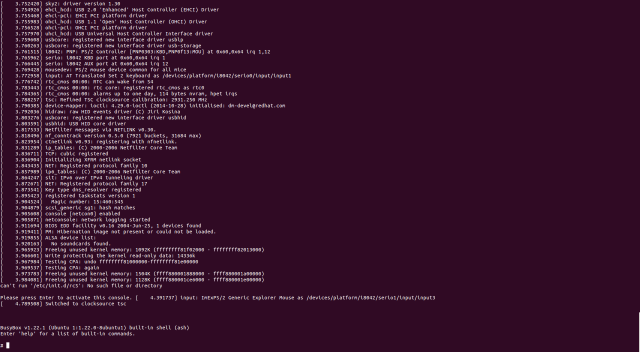

これは[0xAX/linux-insides: A little bit about a linux kernel](https://github.com/0xAX/linux-insides)の非公式翻訳です。

linux-insides
===============

linuxカーネルとその内部についての製作中の本です。

<<<<<<< HEAD
**目標はシンプルです** - Linuxカーネルの内部についての私の知識を共有すること、Linuxカーネル内部やその他の低レイヤーのことに興味のある人を助けることです。
=======
**The goal is simple** - to share my modest knowledge about the insides of the linux kernel and help people who are interested in linux kernel insides, and other low-level subject matter. Feel free to go through the book [Start here](https://github.com/0xAX/linux-insides/blob/master/SUMMARY.md)
>>>>>>> upstream/master

**質問/提案**: 質問や提案は twitter [@0xAX](https://twitter.com/0xAX) または [email](mailto:anotherworldofworld@gmail.com) で連絡を取るか、 [issue](https://github.com/0xAX/linux-insides/issues/new) を作成することで気軽にしてください。

<<<<<<< HEAD
原著者へのサポート
=======
# Mailing List

We have a Google Group mailing list for learning the kernel source code. Here are some instructions about how to use it.

#### Join

Send an email with any subject/content to `kernelhacking+subscribe@googlegroups.com`. Then you will receive a confirmation email. Reply it with any content and then you are done.

> If you have Google account, you can also open the [archive page](https://groups.google.com/forum/#!forum/kernelhacking) and click **Apply to join group**. You will be approved automatically.

#### Send emails to mailing list

Just send emails to `kernelhacking@googlegroups.com`. The basic usage is the same as other mailing lists powered by mailman.

#### Archives

https://groups.google.com/forum/#!forum/kernelhacking

Support
>>>>>>> upstream/master
-------

`linux-insides`を気に入れば以下の方法で **サポート** することができます:

 

他の言語
-------------------

  * [Brazilian Portuguese](https://github.com/mauri870/linux-insides)
  * [Chinese](https://github.com/MintCN/linux-insides-zh)
  * [Japanese](https://github.com/tkmru/linux-insides-ja)
  * [Korean](https://github.com/junsooo/linux-insides-ko)
  * [Russian](https://github.com/proninyaroslav/linux-insides-ru)
  * [Spanish](https://github.com/leolas95/linux-insides)
  * [Turkish](https://github.com/ayyucedemirbas/linux-insides_Turkish)
<<<<<<< HEAD

ライセンス
-------------

Licensed [BY-NC-SA Creative Commons](http://creativecommons.org/licenses/by-nc-sa/4.0/).
=======
>>>>>>> upstream/master

Contributions
--------------

問題があれば、issueもしくはプルリクエストを気軽に作成してください。

**何か変更をpushする前に [CONTRIBUTING.md](https://github.com/0xAX/linux-insides/blob/master/CONTRIBUTING.md)を読んでください。**

原著者
---------------

[@0xAX](https://twitter.com/0xAX)

<<<<<<< HEAD
日本語版翻訳者
---------------

[@tkmru](https://twitter.com/tkmru)
=======
LICENSE
-------------

Licensed [BY-NC-SA Creative Commons](http://creativecommons.org/licenses/by-nc-sa/4.0/).
>>>>>>> upstream/master
