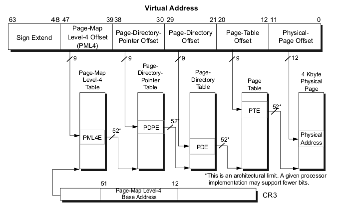

ページング
================================================================================

前書き
--------------------------------------------------------------------------------

`Linuxカーネルのブートプロセス`の[第5部](https://0xax.gitbooks.io/linux-insides/content/Booting/linux-bootstrap-5.html)で、カーネルの初期段階において何をするかを学びました。次のステップでは、カーネルがinitプロセスを実行する前に、`initrd`のマウント、lockdepの初期化など、カーネルが様々な初期化を行います。

ええ、これらの多くの処理がありますが、それらも**メモリ**で動作します。

私の見解では、メモリ管理はLinuxカーネルの最も複雑な部分の1つであり、それは一般にシステムプログラミングで行われます。これが、カーネルの初期化に進む前に、ページングに精通する必要がある理由です。

`ページング`はリニアアドレスから物理アドレスに変換するメカニズムです。本書の前のパートを読んでいるなら、セグメントレジスタを4ビットシフトし、オフセットを追加して物理アドレスを計算すると、リアルモードでセグメンテーションが確認できたことを覚えているかもしれません。また、プロテクトモードでのセグメンテーションも確認しました。このモードでは、ディスクリプタテーブルとオフセット付きのディスクリプタからベースアドレスを使用して、物理アドレスを計算しました。これで、64ビットモードでのページングが表示されます。

Intelのマニュアルにあるように：

> ページングは、プログラムの実行環境の各セクションが必要に応じて物理メモリにマップされる、従来のデマンドページな仮想メモリシステムを実装するためのメカニズムを提供します。

なので...この投稿では、ページングの背後にある理論を説明します。もちろん。それはLinuxカーネルの`x86_64`バージョンと密接に関連していますが、あまり詳細には触れません(少なくともこの投稿では)。

ページングの有効化
--------------------------------------------------------------------------------

3つのページングモードがあります。

* 32ビットページング
* PAEページング
* IA-32eページング

ここでは、最後のモードのみを説明します。`IA-32eページング`モードを有効にするために、次のことを行う必要があります。

* `CR0.PG`ビットを設定します。
* `CR4.PAE`ビットを設定します。
* `IA32_EFER.LME`ビットを設定します。

これらのビットが[arch/x86/boot/compressed/head_64.S](https://github.com/torvalds/linux/blob/16f73eb02d7e1765ccab3d2018e0bd98eb93d973/arch/x86/boot/compressed/head_64.S)にて以下のように設定されていることは既に確認しました。

```assembly
movl	$(X86_CR0_PG | X86_CR0_PE), %eax
movl	%eax, %cr0
```

そして、

```assembly
movl	$MSR_EFER, %ecx
rdmsr
btsl	$_EFER_LME, %eax
wrmsr
```

ページング機構
--------------------------------------------------------------------------------

ページングはリニアアドレス空間を固定サイズのページに分割します。ページは、物理アドレス空間、または外部ストレージにマッピングできます。この固定サイズは`x86_64`のLinuxカーネルでは`4096`バイトになります。リニアアドレスから物理アドレスへ変換するために、特別なストラクチャーが使用されます。すべてのストラクチャーは`4096`バイトで、`512`エントリ(これは`PAE`モードと`IA32_EFER.LME`モードのみ)あります。ページング機構は階層的であり、Linuxカーネルは、`x86_64`アーキテクチャにおいては4レベルのページング階層を利用します。CPUはリニアアドレスの一部を利用して、より低いレベルの他のページングストラクチャーへのエントリ、もしくは物理メモリ領域(`ページフレーム`)、またはこの物理メモリ領域上の物理アドレスのオフセット(`ページオフセット`)を識別します。トップレベルのページングストラクチャーへのアドレスは`cr3`に置きます。これはすでに[arch/x86/boot/compressed/head_64.S](https://github.com/torvalds/linux/blob/16f73eb02d7e1765ccab3d2018e0bd98eb93d973/arch/x86/boot/compressed/head_64.S)で確認済みです。


```assembly
leal	pgtable(%ebx), %eax
movl	%eax, %cr3
```

ページテーブルたちを作成し、トップレベルのページングストラクチャーのアドレスを`cr3`レジスタに配置しています。`cr3`は、トップレベルのページングストラクチャーのアドレス、`PML4`や`Page Global Directory`を格納するために使用されます。`cr3`は64ビットレジスタで、以下のような構造を持ちます。


```
63                  52 51                                                        32
 --------------------------------------------------------------------------------
|                     |                                                          |
|    Reserved MBZ     |            Address of the top level structure            |
|                     |                                                          |
 --------------------------------------------------------------------------------
31                                  12 11            5     4     3 2             0
 --------------------------------------------------------------------------------
|                                     |               |  P  |  P  |              |
|  Address of the top level structure |   Reserved    |  C  |  W  |    Reserved  |
|                                     |               |  D  |  T  |              |
 --------------------------------------------------------------------------------
```

これらのフィールドは、以下の意味を持ちます。

* ビット 63:52 - 予約済みで、0でなければなりません。
* ビット 51:12 - トップレベルのページングストラクチャーのアドレスを保持します。
* ビット 11: 5 - 予約済みで、0でなければなりません。
* ビット 4 : 3 - PWT、またはページレベルのライトスルーとPCD、またはページレベルのキャッシュの無効化状態を示します。これらのビットは、ハードウェアキャッシュによるページまたはページテーブルの処理方法を制御します。
* Bits 2 : 0 - 予約済みです。

リニアアドレス変換は以下の通りです。

* 与えられたリニアアドレスは、メモリバスに代わって[MMU](http://en.wikipedia.org/wiki/Memory_management_unit)に到着します。
* 64ビットリニアアドレスはいくつかに分割されます。下位48ビットのみが重要で、`2^48`、つまり256テラバイトのリニアアドレス空間にいつでもアクセスできることを意味します。
* `cr3`レジスタは4つのトップレベルのページングストラクチャーのアドレスを保持します。
* 与えられたリニアアドレスの`47:39`ビットは、レベル4のページング構造体のインデックスを、`38:30`ビットはレベル3を、`29;21`ビットはレベル2を、`20:12`はレベル1をそれぞれ格納しており、`11:0`は物理ページへのオフセットをバイト単位で提供します。

概略的には、次のようになります。



リニアアドレスへのアクセスはすべて、スーパーバイザモード、もしくはユーザーモードアクセスのいずれかです。このアクセス種別は、`CPL`(Current Privilege Level)によって決定されます。`CPL < 3`の場合、スーパーバイザモードでのアクセスで、それ以外ならばユーザーモードのアクセスです。例えば、トップレベルのページテーブルエントリにはアクセスビットが含まれ、以下のような構造を持ちます。(ビットオフセットの定義は[arch/x86/include/asm/pgtable_types.h](https://github.com/torvalds/linux/blob/16f73eb02d7e1765ccab3d2018e0bd98eb93d973/arch/x86/include/asm/pgtable_types.h)を参照してください。)


```
63  62                  52 51                                                    32
 --------------------------------------------------------------------------------
| N |                     |                                                     |
|   |     Available       |     Address of the paging structure on lower level  |
| X |                     |                                                     |
 --------------------------------------------------------------------------------
31                                              12 11  9 8 7 6 5   4   3 2 1     0
 --------------------------------------------------------------------------------
|                                                |     | M |I| | P | P |U|W|    |
| Address of the paging structure on lower level | AVL | B |G|A| C | W | | |  P |
|                                                |     | Z |N| | D | T |S|R|    |
 --------------------------------------------------------------------------------
```

Where:

* 63ビット - N/X ビット(No Execute:実行禁止ビット)。テーブルエントリによってマッピングされた物理アドレスから、コードを実行する機能を示します。
* 62:52ビット - CPUによって無視され、システムソフトウェアによって使用されます。
* 51:12ビット - 下位レベルのページング構造体の物理アドレスを格納します。
* 11: 9ビット - CPUによって無視されます。
* MBZ - Must Be Zero. ゼロビットでなければなりません。
* IGN - 無視されます。
* A - アクセスビット。物理ページまたはページ構造体へアクセスされたことを示します。
* PWT と PCD - キャッシュのために使用されます。
* U/S - ユーザー/スーパーバイザビット。このテーブルエントリによってマップされた、すべての物理ページへのユーザーアクセスを制御します。
* R/W - 読み取り/書き込みビット。このテーブルエントリによってマッピングされたすべての物理ページへの読み取り/書き込みアクセスを制御します。
* P - プレゼント(Present)ビット。ページテーブルもしくは物理ページが、メモリにロードされているかどうかを示します。

さて、ページング構造体とそのエントリについて学びました。それでは、Linuxカーネルの4レベルページングに関する詳細を見ていきましょう。

Linuxカーネルのページング構造
--------------------------------------------------------------------------------

これまで見てきたように、`x86_64`のLinuxカーネルは4レベルページテーブルを利用しています。これらの名前は以下です。

* ページグローバルディレクトリ(Page Global Directory)
* ページアッパーディレクトリ(Page Upper  Directory)
* ページミドルディレクトリ(Page Middle Directory)
* ページテーブルエントリ(Page Table Entry)

Linuxカーネルをコンパイルしてインストールした後、カーネルで使用される関数の仮想ドレスを`System.map`ファイルにて確認できます。例えば、

```
$ grep "start_kernel" System.map
ffffffff81efe497 T x86_64_start_kernel
ffffffff81efeaa2 T start_kernel
```

ここでは、`0xffffffff81efe497`とアドレスが記載されています。そんなに大きなRAMが本当に取り付けられているとは思えません。しかし、`start_kernel`と`x86_64_start_kernel`は実行されるでしょう。`x86_64`のアドレス空間のサイズは`2^64`ですが、大きすぎるため、48ビット幅の小さなアドレス空間が使用されます。そのため、物理アドレス空間としては48ビットに制限していますが、アドレッシングは64ビットポインタで行います。どうやってこの問題を解決しているのでしょうか？以下の図を見てください。

```
0xffffffffffffffff  +-----------+
                    |           |
                    |           | Kernelspace
                    |           |
0xffff800000000000  +-----------+
                    |           |
                    |           |
                    |   hole    |
                    |           |
                    |           |
0x00007fffffffffff  +-----------+
                    |           |
                    |           |  Userspace
                    |           |
0x0000000000000000  +-----------+
```

この解決方法は、`符号拡張(sign extension)`です。仮想アドレスの下位48ビットがアドレッシングに利用されます。`63:48`ビットはすべて0またはすべて1のみです。仮想アドレス空間は2つの部分に分かれることに注意してください。

* カーネル空間(Kernel space)
* ユーザー空間(Userspace)

ユーザー空間は仮想アドレス空間の下位部分、具体的には`0x000000000000000`から`0x00007fffffffffff`、を占有し、カーネル空間は上位部分、具体的には`0xffff8000000000`から`0xffffffffffffffff`、を占有しています。`63:48`ビットは、ユーザー空間ではすべて0、カーネル空間ではすべて1であることに注意してください。カーネル空間とユーザー空間のすべてのアドレス、言い換えると上位`63:48`ビットがすべて0か1であるアドレスを、`カノニカル(canonical)`アドレスと呼びます。なお、これらのメモリ領域の間には、`非カノニカル(non-cannonical)`領域が存在します。これら2つのメモリ領域(カーネル空間とユーザー空間)を合わせたビット幅は、確かに`2^48`となります。なお、[Documentation/x86/x86_64/mm.txt](https://github.com/torvalds/linux/blob/16f73eb02d7e1765ccab3d2018e0bd98eb93d973/Documentation/x86/x86_64/mm.txt)にて、4レベルページテーブル仮想メモリマップの説明があります。

```
0000000000000000 - 00007fffffffffff (=47 bits) user space, different per mm
hole caused by [48:63] sign extension
ffff800000000000 - ffff87ffffffffff (=43 bits) guard hole, reserved for hypervisor
ffff880000000000 - ffffc7ffffffffff (=64 TB) direct mapping of all phys. memory
ffffc80000000000 - ffffc8ffffffffff (=40 bits) hole
ffffc90000000000 - ffffe8ffffffffff (=45 bits) vmalloc/ioremap space
ffffe90000000000 - ffffe9ffffffffff (=40 bits) hole
ffffea0000000000 - ffffeaffffffffff (=40 bits) virtual memory map (1TB)
... unused hole ...
ffffec0000000000 - fffffc0000000000 (=44 bits) kasan shadow memory (16TB)
... unused hole ...
ffffff0000000000 - ffffff7fffffffff (=39 bits) %esp fixup stacks
... unused hole ...
ffffffff80000000 - ffffffffa0000000 (=512 MB)  kernel text mapping, from phys 0
ffffffffa0000000 - ffffffffff5fffff (=1525 MB) module mapping space
ffffffffff600000 - ffffffffffdfffff (=8 MB) vsyscalls
ffffffffffe00000 - ffffffffffffffff (=2 MB) unused hole
```

ここには、ユーザー空間、カーネル空間、非カノニカル領域のメモリマップが記載されています。ユーザー空間のマッピングはシンプルなので、カーネル空間を詳しく見てみましょう。ハイパーバイザのために予約されている、ガードホール(guard hole)から始まっていることがわかります。ガードホールは、[arch/x86/include/asm/page_64_types.h](https://github.com/torvalds/linux/blob/16f73eb02d7e1765ccab3d2018e0bd98eb93d973/arch/x86/include/asm/page_64_types.h)にて以下のように定義されています。

```C
#define __PAGE_OFFSET _AC(0xffff880000000000, UL)
```

以前は、このガードホールと`__PAGE_OFFSET`は、非カノニカル領域へアクセスさせないために、`0xffff800000000000`から`0xffff87ffffffffff`のアドレスとなっていましたが、のちにハイパーバイザのために3ビット拡張されました。

次は、カーネル空間で使用可能な最低アドレス、つまり`ffff880000000000`となります。この仮想メモリ領域は全物理メモリのダイレクトマッピング用です。この全物理アドレスをマッピングするメモリ空間の後に、ガードホールがあります。これは、全物理メモリのダイレクトマッピングする領域とvmalloc領域の間にある必要があります。そして、64テラバイトの仮想メモリ用マップと未使用のホールの後に、`kasan`シャドウメモリがあります。これは、[commit](https://github.com/torvalds/linux/commit/ef7f0d6a6ca8c9e4b27d78895af86c2fbfaeedb2)にて追加され、カーネルアドレスサニタイザ(Kernel Address SANitizer)を提供します。そして、未使用のホールの後、`esp`修正スタック(`esp` fixup stacks)(本書の他の部分で説明します)と、物理アドレスからのカーネルテキストマッピングの開始アドレス(つまり物理アドレス上では0)があります。このアドレス定義は、`__PAGE_OFFSET`と同じファイルにあります。

```C
#define __START_KERNEL_map      _AC(0xffffffff80000000, UL)
```

通常、カーネルの`.text`は、このアドレスに`CONFIG_PHYSICAL_START`オフセットを加味して開始します。 [ELF64](https://github.com/0xAX/linux-insides/blob/master/Theory/ELF.md)に関する説明でそれを見ました。

```
readelf -s vmlinux | grep ffffffff81000000
     1: ffffffff81000000     0 SECTION LOCAL  DEFAULT    1 
 65099: ffffffff81000000     0 NOTYPE  GLOBAL DEFAULT    1 _text
 90766: ffffffff81000000     0 NOTYPE  GLOBAL DEFAULT    1 startup_64
```

上記結果で、`vmlinux`の`CONFIG_PHYSICAL_START`が`0x1000000`であることを確認します。カーネルの`.text`の開始アドレスが`0xffffffff80000000`であるので、オフセットが`0x1000000`であれば、結果的に仮想アドレスは`0xffffffff80000000 + 1000000 = 0xffffffff81000000`となります。

カーネルの`.text`領域の後には、カーネルモジュール用の仮想メモリ領域、`vsyscalls`、2メガバイトの未使用のホールがあります。

カーネルの仮想メモリマップがどのようにレイアウトされ、仮想アドレスがどのように物理アドレスに変換されるかを見てきました。例として次のアドレスを見てみましょう。

```
0xffffffff81000000
```

二進数表記では：

```
1111111111111111 111111111 111111110 000001000 000000000 000000000000
      63:48        47:39     38:30     29:21     20:12      11:0
```

この仮想アドレスは、上記のように部分的に分割されています。

* `63:48` - 未使用ビットです。
* `47:39` - レベル4のページングストラクチャーのインデックスです。
* `38:30` - レベル3のページングストラクチャーのインデックスです。
* `29:21` - レベル2のページングストラクチャーのインデックスです。
* `20:12` - レベル1のページングストラクチャーのインデックスです。
* `11:0`  - 物理ページへのオフセットをバイト単位で表しています。

以上です。これで`ページング`の理論について少し理解できたので、実際にカーネルのソースコードをみて、最初の初期化ステップを見ていきましょう。

結論
--------------------------------------------------------------------------------

ページング理論に関する短い説明は終わりです。もちろん、この投稿ではページングのすべての詳細をカバーしているわけではありませんが、Linuxカーネルがページング機構をどのように構築し、どのように機能するかを実際に見ていきます。

英語は私の第一言語ではありません。ご不便をおかけして申し訳ありません。間違いを見つけた場合は、[linux-insides](https://github.com/0xAX/linux-insides)に PRを送ってください。

リンク集
--------------------------------------------------------------------------------

* [Paging on Wikipedia](http://en.wikipedia.org/wiki/Paging)
* [Intel 64 and IA-32 architectures software developer's manual volume 3A](http://www.intel.com/content/www/us/en/processors/architectures-software-developer-manuals.html)
* [MMU](http://en.wikipedia.org/wiki/Memory_management_unit)
* [ELF64](https://github.com/0xAX/linux-insides/blob/master/Theory/ELF.md)
* [Documentation/x86/x86_64/mm.txt](https://github.com/torvalds/linux/blob/16f73eb02d7e1765ccab3d2018e0bd98eb93d973/Documentation/x86/x86_64/mm.txt)
* [Last part - Kernel booting process](https://0xax.gitbooks.io/linux-insides/content/Booting/linux-bootstrap-5.html)
